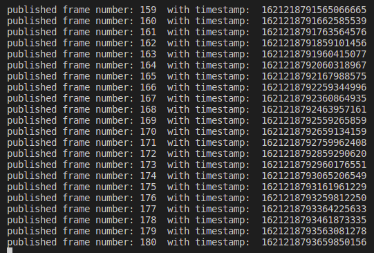
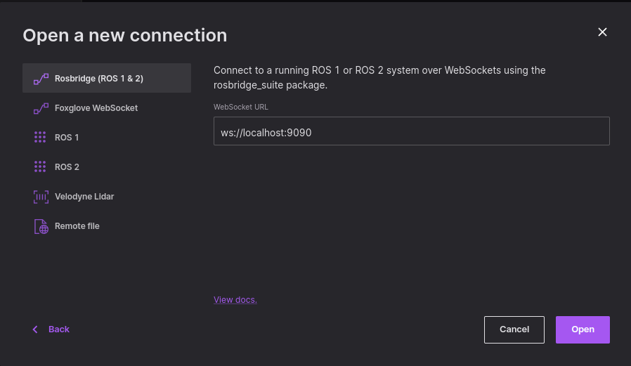

# ROS Workspace for Autonomous Kart Project

This repository contains the ROS workspace for the Autonomous Kart Project.

## Installation Steps:

- It is better to follow the steps using Ubuntu 18.04 LTS or Ubuntu 20.04 LTS. In case you are a windows machine user, you can use Ubuntu 20.04 LTS on Windows 10 using WSL2 or install a virtual machine with Ubuntu 20.04 LTS
- From Ubuntu 20.04, install ROS Melodic or ROS Noetic. Follow the steps from [here](https://linuxopsys.com/topics/install-ros-noetic-on-ubuntu)
- For Mac users, follow the [following video](https://www.youtube.com/watch?v=zF7Pbq4Puvg&amp;ab_channel=BorisMeinardus&ab_channel=BorisMeinardus) to install ROS on your machine natively
- run the following command:
```bash
git clone https://github.com/ahmedmbakr/autonomous_kart_ros_vis.git
cd autonomous_kart_ros_vis
catkin_make
```
- The last command should generate two folders: `build` and `devel`
- run the following command:
```bash
sudo apt-get install ros-noetic-rosbridge-suite
source devel/setup.bash
roslaunch rosbridge_server rosbridge_websocket.launch
```
- The expected output is the following image:

- Download the testrosbag from this link: [testrosbag](https://www.dropbox.com/s/8vwkero6boujtzb/UrbanNav-HK_CHTunnel-20210518_sensors.bag?dl=0). Refer to [this link](https://github.com/IPNL-POLYU/UrbanNavDataset/blob/master/README.md) for the complete sensor setup and rosbag description
- Update line 26 in `talker2.py` with the path to the downloaded rosbag
- Download and install anaconda from [here](https://repo.anaconda.com/archive/Anaconda3-2022.10-Linux-x86_64.sh)
- Install `Anaconda` using the following commands:
```bash
bash ./Anaconda3-2022.10-Linux-x86_64.sh
conda env create -f environment.yaml
conda activate kart_env
```
- Open another terminal and run the following command:
```bash
source devel/setup.bash
rosrun first_package talker2.py
```
- The expected output is the following image:

- Open `foxglove`, choose `Open Connection` and write the following URL: `ws://localhost:9090` under `Rosbridge (Ros1 & 2) tab, as shown in the attached image:


## Normal Run:

This section describes how you normally run the program after you have followed the installation steps successfully.

- In a new terminal, execute the following commands:
```bash
source devel/setup.bash
roslaunch rosbridge_server rosbridge_websocket.launch
```
- In a new terminal, execute the following command to run the rosnode
```bash
cd autonomous_kart_ros_vis
conda activate kart_env
rosrun first_package talker2.py
```

## Connecting to Real Velodyne Lidar
The main steps are followed from [this link](http://wiki.ros.org/velodyne/Tutorials/Getting%20Started%20with%20the%20Velodyne%20VLP16)

### General Information about the Lidar:
 - Lidar IP address: 192.168.1.201
 - Lidar UDP socket: 2368

### Connecting to the lidar steps for the first time:
 - Change your PC's ip address manually to be:
    - IP: `192.168.1.xx`, where `xx` can be replaced with any number from 10 to 199
    - Netmask: `255.255.255.0`
    - Default Gateway: `192.168.1.1`
 - Open a browser and try to connect to `192.168.1.201`, you should be able to see the lidar webpage
 - Open a terminal window and do the following:
    ```bash
        cd THIS_REPOSITORY_ROOT_FOLDER/src
        git clone https://github.com/ros-drivers/velodyne.git
        cd ..
        sudo apt-get install ros-noetic-velodyne
        rosdep install --from-paths src --ignore-src --rosdistro noetic -y
        catkin_make
        ```
 -  Test that the lidar is connected successfully and the ros node can read the data by executing the following:
     ```bash
        source devel/setup.bash
        roslaunch velodyne_pointcloud VLP16_points.launch
        rosnode list
        rostopic echo /velodyne_points
        ```
 - To be able to run rosbridge with the velodyne ros lanuch file, edit the file: `src/velodyne/velodyne_pointcloud/launch/VLP16_points.launch` and add the following at the end just before `</launch>` command:
     ```bash
          <include file="$(find rosbridge_server)/launch/rosbridge_websocket.launch">
            <arg name="port" value="9090" />
         </include>
        ```
- Now run `roslaunch velodyne_pointcloud VLP16_points.launch` again and open foxglove to view the lidar data along with the other published data

## Known Issues:
- If you face error when running any `sudo` command in Ubunu, refer to the [following video](https://youtu.be/jZGHtuxpaP4) to solve the issue, thanks to Kate Sanborn

## Maintainers
- Ahmed Bakr (ambakr@crimson.ua.edu) or (ahmed.m.ali.bakr@gmail.com)
